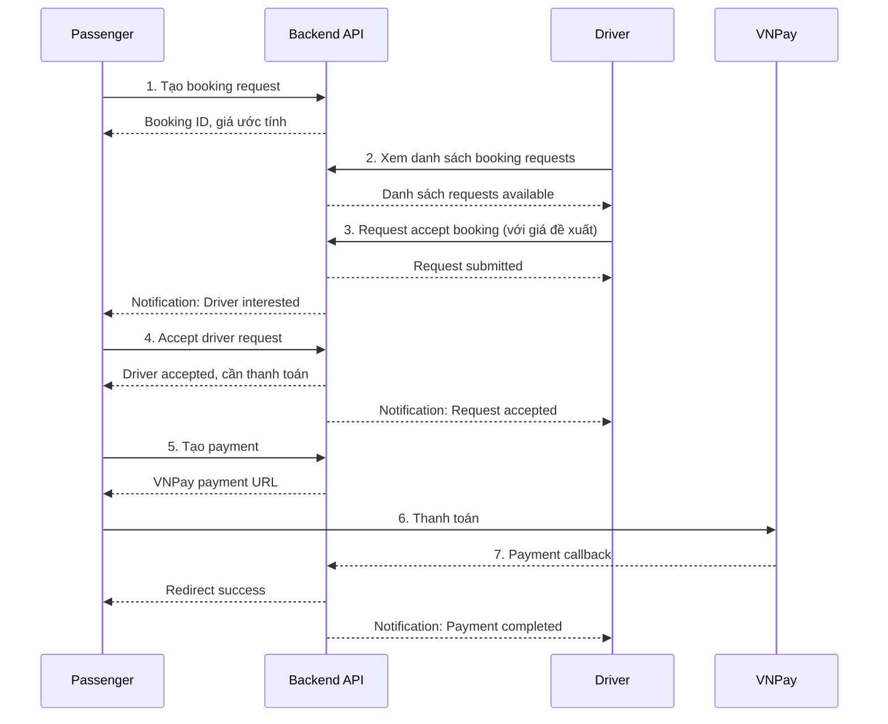

# 🚗 Carpooling Booking Flow Guide

## Luồng Mới: Passenger Tạo Booking Request, Driver Accept

### 📋 Tổng Quan Luồng



### 🔄 Chi Tiết Từng Bước

#### 1. Passenger Tạo Booking Request

**API:** `POST /api/trips`

```json
{
	"startLocation": {
		"address": "123 Nguyễn Huệ, Q1, HCM",
		"coordinates": {
			"lat": 10.7769,
			"lng": 106.7009
		}
	},
	"endLocation": {
		"address": "456 Lê Lợi, Q3, HCM",
		"coordinates": {
			"lat": 10.7851,
			"lng": 106.7085
		}
	},
	"departureTime": "2024-01-15T08:00:00.000Z",
	"preferredVehicleType": "car",
	"maxPrice": 100000,
	"requestNote": "Cần đi gấp, tôi sẽ chờ ở tầng 1"
}
```

**Response:**

```json
{
  "success": true,
  "message": "Booking request created successfully. Waiting for drivers to respond.",
  "data": {
    "_id": "trip_id",
    "status": "pending_driver",
    "requestedBy": "user_id",
    "driver": null
  },
  "pricing": {
    "estimatedPrice": 85000,
    "maxPrice": 100000,
    "breakdown": { ... }
  }
}
```

#### 2. Driver Xem Available Bookings

**API:** `GET /api/trips?role=driver`

**Response:**

```json
{
  "success": true,
  "data": [
    {
      "_id": "trip_id",
      "status": "pending_driver",
      "requestedBy": {
        "_id": "passenger_id",
        "fullName": "Nguyễn Văn A",
        "rating": 4.8
      },
      "startLocation": { ... },
      "endLocation": { ... },
      "departureTime": "2024-01-15T08:00:00.000Z",
      "preferredVehicleType": "car",
      "maxPrice": 100000,
      "requestNote": "Cần đi gấp..."
    }
  ]
}
```

#### 3. Driver Request Accept Booking

**API:** `POST /api/trips/:id/driver-request`

```json
{
	"proposedPrice": 95000,
	"message": "Tôi có thể đón bạn đúng giờ, xe Honda City mới"
}
```

**Response:**

```json
{
  "success": true,
  "message": "Driver request submitted successfully",
  "data": {
    "tripId": "trip_id",
    "request": {
      "driver": {
        "fullName": "Trần Văn B",
        "vehicle": { ... },
        "rating": 4.9
      },
      "proposedPrice": 95000,
      "message": "Tôi có thể đón bạn...",
      "status": "pending"
    }
  }
}
```

#### 4. Passenger Accept Driver Request

**API:** `PATCH /api/trips/:id/driver-requests/:requestId`

```json
{
	"action": "accept"
}
```

**Response:**

```json
{
	"success": true,
	"message": "Driver request accepted! Please proceed to payment.",
	"data": {
		"trip": {
			"status": "confirmed",
			"driver": "driver_id",
			"price": 95000
		},
		"needsPayment": true,
		"finalPrice": 95000
	}
}
```

#### 5. Tạo Payment

**API:** `POST /api/payments/create`

```json
{
	"tripId": "trip_id"
}
```

**Response:**

```json
{
	"success": true,
	"data": {
		"paymentId": "payment_id",
		"paymentUrl": "https://sandbox.vnpayment.vn/paymentv2/vpcpay.html?...",
		"amount": "95,000 VND"
	}
}
```

#### 6. Sau Payment Thành Công

Trip status tự động chuyển thành `'paid'` và sẵn sàng thực hiện chuyến đi.

### 📊 Trip Status Flow

```
pending_driver → confirmed → paid → in_progress → completed
     ↓             ↓         ↓         ↓
  cancelled    cancelled  cancelled  cancelled
```

### 🔒 Quyền Truy Cập APIs

| API                                           | Passenger         | Driver         | Admin |
| --------------------------------------------- | ----------------- | -------------- | ----- |
| `POST /trips`                                 | ✅                | ✅             | ✅    |
| `GET /trips?role=passenger`                   | ✅ (own trips)    | ❌             | ✅    |
| `GET /trips?role=driver`                      | ❌                | ✅ (available) | ✅    |
| `POST /trips/:id/driver-request`              | ❌                | ✅             | ❌    |
| `PATCH /trips/:id/driver-requests/:requestId` | ✅ (if requester) | ❌             | ✅    |
| `POST /payments/create`                       | ✅ (if requester) | ❌             | ❌    |

### ⚡ Notifications

- **Driver request submitted** → Passenger nhận thông báo
- **Driver request accepted** → Driver nhận thông báo
- **Payment completed** → Driver nhận thông báo
- **Trip status updates** → Cả hai nhận thông báo

### 🛠️ Testing với Postman

1. **Đăng nhập làm Passenger**
2. **Tạo booking request**
3. **Đăng nhập làm Driver** (account khác)
4. **Xem available bookings**
5. **Submit driver request**
6. **Đăng nhập lại làm Passenger**
7. **Accept driver request**
8. **Tạo payment và test VNPay**

### 📱 Frontend Integration

```javascript
// Tạo booking request
const createBooking = async (bookingData) => {
	const response = await fetch('/api/trips', {
		method: 'POST',
		headers: {
			Authorization: `Bearer ${token}`,
			'Content-Type': 'application/json',
		},
		body: JSON.stringify(bookingData),
	});
	return response.json();
};

// Driver accept booking
const acceptBooking = async (tripId, proposedPrice, message) => {
	const response = await fetch(`/api/trips/${tripId}/driver-request`, {
		method: 'POST',
		headers: {
			Authorization: `Bearer ${token}`,
			'Content-Type': 'application/json',
		},
		body: JSON.stringify({ proposedPrice, message }),
	});
	return response.json();
};

// Passenger accept driver
const acceptDriver = async (tripId, requestId) => {
	const response = await fetch(`/api/trips/${tripId}/driver-requests/${requestId}`, {
		method: 'PATCH',
		headers: {
			Authorization: `Bearer ${token}`,
			'Content-Type': 'application/json',
		},
		body: JSON.stringify({ action: 'accept' }),
	});
	return response.json();
};
```

### 🔧 Environment Variables

Đảm bảo có các biến môi trường VNPay:

```env
VNPAY_TMN_CODE=4680X3ZG
VNPAY_HASH_SECRET=J5RKHN2SW0YUS4L6MYSYQRXIA6W9NZ6I
VNPAY_URL=https://sandbox.vnpayment.vn/paymentv2/vpcpay.html
VNPAY_RETURN_URL=http://localhost:5000/api/payments/vnpay/return
VNPAY_FRONTEND_RETURN_URL=http://localhost:3000/vnpay-return
```

### 🎯 Ưu Điểm Luồng Mới

- ✅ **Passenger-centric**: Người dùng tạo request theo nhu cầu
- ✅ **Competitive pricing**: Driver có thể đề xuất giá cạnh tranh
- ✅ **Flexible**: Passenger có nhiều lựa chọn driver
- ✅ **Secure payment**: Chỉ thanh toán sau khi confirm driver
- ✅ **Clear responsibility**: Phân quyền rõ ràng theo trạng thái
- ✅ **Better UX**: Luồng trực quan và dễ hiểu
